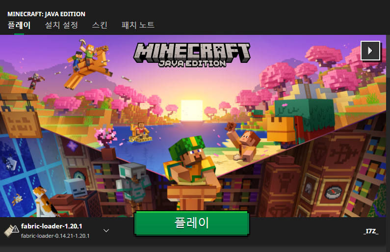

# 서버에 접속하기

마인크래프트에서 RE:Vanilla 서버를 접속하는 방법에 대해 더 자세히 알아봅니다.

### 사전 준비

* 마인크래프트를 플레이할 수 있는 마이크로소프트 계정이 필요합니다.
* 멀티플레이를 이용할 수 있는 환경이 준비되어야 합니다.

### 런처로 마인크래프트 실행하기

마인크래프트 런처에 로그인하면 다음과 같은 화면이 표시됩니다

<figure><figcaption>
마인크래프트 런처, 2023년 7월 21일
</figcaption></figure>

위 화면에서 중앙에 초록색 '플레이' 버튼을 클릭합니다. 지역 및 언어에 따라 표시되는 텍스트는 다를 수 있습니다.

| 📒 이 서버는 최신 릴리스로 동작합니다. 만약 런처에서 버전을 변경하지 않았다면, 마인크래프트가 최신 릴리스로 실행됩니다. 만약 버전을 변경한 경우, 이 서버에 접속하려면 먼저 클라이언트에서 실행할 버전을 최신 릴리스로 변경해야 합니다. |
| ------------------------------------------------------------------------------------------------------------------------------------- |

### 서버에 접속하기

위 방법을 통해 마인크래프트를 실행하면 아래와 같은 화면이 표시됩니다.

<figure><figcaption>
마인크래프트 1.20.1, <a href="https://fabricmc.net/"><mark style="color:blue;">패브릭</mark></a>및 <a href="https://www.curseforge.com/minecraft/mc-mods/modmenu"><mark style="color:blue;">모드 메뉴</mark></a>가 설치됨
</figcaption></figure>

'멀티플레이' 버튼(Multiplayer)을 클릭하면 아래 화면이 표시됩니다.\

<figure><figcaption>
마인크래프트 멀티플레이 화면
</figcaption></figure>

서버 추가' 버튼(Add Server)을 클릭하면 아래와 같은 화면이 표시됩니다.\

<figure><figcaption>
마인크래프트 멀티플레이 서버 추가 화면
</figcaption></figure>

위와 같이 표시된 화면에서 '서버 주소' 란(Server Address)에 `revanilla.site` 을 입력한 후 '확인' 버튼(Done)을 누릅니다.\

<figure><figcaption>
마인크래프트 멀티플레이 화면. RE:Vanilla 서버가 추가됨
</figcaption></figure>

이제 추가된 서버를 클릭하여 선택하고 '서버 참여' 버튼(Join Server)을 클릭하면 서버에 접속할 수 있습니다.
