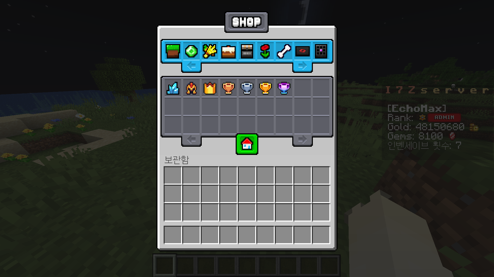
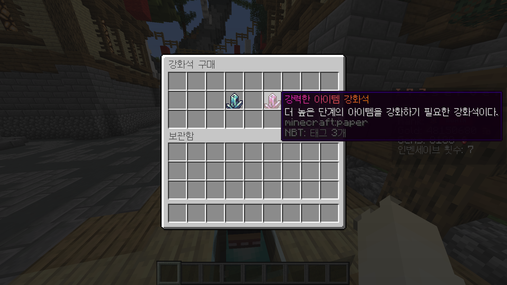

# 가이드 라인

서버 가이드

저희 I7Z 서버는 야생 기반의 RPG 위주 서버 입니다

기존 야생보다 다양한 바이옴과 구조물이 추가되어있고

보스, 커스텀 인챈트, 아이템 강화, 펫, 그 외 추후 업데이트 될

여러가지 컨텐츠가 준비되어 있습니다

이하 대부분의 기능은 shift + f 를 눌러 확인하실 수 있습니다

1. 서버 상점

여러가지 농작물, 광물 등을 판매하여 화폐를 얻을 수 있습니다

2. 랭크

<figure><figcaption></figcaption></figure>

칭호를 업그레이드 하여 더욱 많은 컨텐츠를 즐길 수 있습니다

3. 월드 이동

(사진)

거주야생/자원야생/유저워프 로 나눠져 있습니다

4. 유저 상점

<figure><figcaption></figcaption></figure>

어디서든 유저 상점에 아이템을 등록, 구매 할 수 있습니다

5. 펫/커스텀 아이템 강화

<figure><figcaption></figcaption></figure>

스폰에서 펫/강화석을 구매 할 수 있습니다

6. 전직 및 스킬 (추후 업데이트)
7. 길드 (추후 업데이트)
